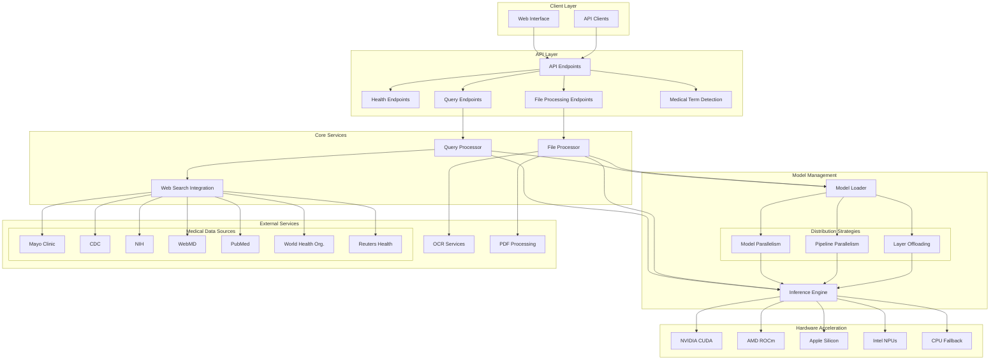

<div align="center">
  
# ClinicalGPT Medical Assistant

<i>A sophisticated medical assistant application that combines large language models with trusted medical sources to provide accurate medical information and analysis.</i>

[](#prerequisites)
[](#prerequisites)
[](#prerequisites)
[](https://huggingface.co/HPAI-BSC/Llama3.1-Aloe-Beta-8B)
[](https://www.selenium.dev/) <!-- Changed from BeautifulSoup -->
[](https://www.nltk.org/)
[](https://scikit-learn.org/)
[](https://flask-cors.readthedocs.io/)
[](https://pandas.pydata.org/)
[](https://python-pillow.org/)
[](https://tqdm.github.io/)
[](https://github.com/theskumar/python-dotenv)
[](https://docs.pytest.org/)
[](https://validators.readthedocs.io/)
<!-- [](https://huggingface.co/docs/accelerate) -->
<!-- [](https://huggingface.co/docs/transformers) -->

[](LICENSE)
[](../../issues)
[](../../commits)
[]()
[](#-key-components)
[](#-api-reference)

<!-- []()
[](#-contributing) -->

</div>

<div align="center">

<!-- ## 📑 Table of Contents -->

<br>  

[ClinicalGPT Medical Assistant](#clinicalgpt-medical-assistant)
  • [🌟 Features](#-features)
  • [🛠️ System Architecture](#️-system-architecture)
  • [🚀 Quick Start](#-quick-start)
    ∘ [Prerequisites](#prerequisites)
    ∘ [Installation](#installation)
    ∘ [Using the Application](#using-the-application)
  • [🔧 Configuration](#-configuration)
    ∘ [Environment Variables](#environment-variables)
    ∘ [Trusted Domains](#trusted-domains)
  • [🎯 Key Components](#-key-components)
    ∘ [Server (`server/`)](#server-server)
    ∘ [Utils (`utils/`)](#utils-utils)
  • [📝 API Reference](#-api-reference)
    ∘ [Endpoints](#endpoints)
    ∘ [Sample Request](#sample-request)
  • [🔐 Security](#-security)
  • [🤝 Contributing](#-contributing)
  • [📜 License](#-license)
  • [🙏 Acknowledgments](#-acknowledgments)

</div>

<!-- <div align="center">
  
# ClinicalGPT Medical Assistant

<i>A sophisticated medical assistant application that combines large language models with trusted medical sources to provide accurate medical information and analysis.</i>


[]()


</div> -->

<div align="center">
  
## 🌟 Features
</div>

- **Intelligent Medical Queries**: Get accurate responses to medical questions using state-of-the-art language models
- **Web Search Integration**: Automatic search and validation from trusted medical sources
- **File Analysis**: Process medical documents including:
  - Text files (.txt)
  - CSV data files
  - JSON documents
  - Medical images 
  - PDF documents 
- **Modern Web Interface**: Responsive design with real-time feedback
- **History Management**: Track and review past queries and analyses
- **Multi-Device Support**: Intelligent hardware acceleration on:
  - NVIDIA GPUs (CUDA)
  - AMD GPUs (ROCm)
  - Apple Silicon (MPS)
  - Intel NPUs
  - CPU fallback
- **Medical Disclaimer**: Transparent communication about AI limitations and the informational nature of responses

<div align="center">
  
## 🛠️ System Architecture

```mermaid 
sequenceDiagram
    participant User
    participant WebUI as Web Interface
    participant APILayer as API Endpoints
    participant QueryProc as Query Processor
    participant FileProc as File Processor
    participant WebSearch as Web Search Integration
    participant ModelMgmt as Model Management
    participant InfEngine as Inference Engine
    participant DistStrat as Distribution Strategies
    participant HWAccel as Hardware Acceleration
    participant ExtSrc as External Medical Sources

    %% User submits a query
    User->>WebUI: Enters medical query
    WebUI->>APILayer: POST /api/query
    APILayer->>QueryProc: Process query request
    
    %% Web search if enabled
    alt Web search enabled
        QueryProc->>QueryProc: Extract Keywords from Query %% Added keyword extraction step
        QueryProc->>WebSearch: Search using keywords %% Modified to use keywords
        WebSearch->>ExtSrc: Query trusted medical websites
        ExtSrc-->>WebSearch: Return medical information
        WebSearch-->>QueryProc: Return search results
        QueryProc->>QueryProc: Enhance prompt with web results and original query
    end
    
    %% Model processing
    QueryProc->>ModelMgmt: Request model inference
    ModelMgmt->>DistStrat: Apply distribution strategy
    
    %% Choose appropriate hardware acceleration
    alt NVIDIA GPU Available
        DistStrat->>HWAccel: Use CUDA acceleration
    else AMD GPU Available
        DistStrat->>HWAccel: Use ROCm acceleration
    else Apple Silicon
        DistStrat->>HWAccel: Use MPS acceleration
    else Intel NPU
        DistStrat->>HWAccel: Use Intel NPU acceleration
    else
        DistStrat->>HWAccel: Use CPU fallback
    end
    
    %% Inference process
    HWAccel-->>InfEngine: Hardware-accelerated processing
    InfEngine-->>ModelMgmt: Return model response
    ModelMgmt-->>QueryProc: Return formatted response
    
    %% Combine results
    QueryProc-->>APILayer: Return combined results
    APILayer-->>WebUI: Return JSON response
    WebUI->>WebUI: Format response with Markdown
    %% Removed the specific highlighting step as it's now optional/potentially removed
    %% WebUI->>WebUI: Apply medical term highlighting 
    WebUI-->>User: Display formatted response

    %% Alternative flow for file upload
    rect rgb(71, 73, 73)
        Note over User,WebUI: File Upload Flow 
        User->>WebUI: Uploads medical file
        WebUI->>APILayer: POST /api/process-file
        APILayer->>FileProc: Process uploaded file
        
        alt PDF Document
            FileProc->>FileProc: Extract text and structure
        else Image File
            FileProc->>FileProc: Perform OCR
        else CSV/JSON
            FileProc->>FileProc: Parse data structure
        else Text File
            FileProc->>FileProc: Process plain text
        end
        
        FileProc->>ModelMgmt: Request file analysis
        ModelMgmt->>InfEngine: Generate analysis
        InfEngine-->>ModelMgmt: Return analysis
        ModelMgmt-->>FileProc: Return analysis results
        FileProc-->>APILayer: Return processed results
        APILayer-->>WebUI: Return JSON response
        WebUI->>WebUI: Format file analysis results
        WebUI-->>User: Display file analysis
    end
```

</div>





<div align="center">
  
## 🚀 Quick Start
</div>

### Prerequisites

- Python 3.12 or higher
- PyTorch compatible hardware (GPU recommended)
- Internet connection for web search features
- **Microsoft C++ Build Tools**: Required on Windows for compiling certain Python packages with C extensions (e.g., some dependencies for advanced file processing). Download from [Visual Studio Build Tools](https://visualstudio.microsoft.com/visual-cpp-build-tools/). Ensure "C++ build tools" are selected during installation.
- **WebDriver**: Required for web scraping using Selenium. Download the appropriate WebDriver for your browser (e.g., [ChromeDriver](https://chromedriver.chromium.org/downloads) for Chrome, [GeckoDriver](https://github.com/mozilla/geckodriver/releases) for Firefox) and ensure its executable is in your system's PATH or specify the path during configuration (not yet implemented).

### Installation

1. Clone the repository:
```bash
git clone [repository-url]
cd mastersDegree-finalProject
```

2. Run the setup script:
```bash
run.bat
```

The script will:
- Create a virtual environment
- Install dependencies
- Configure PyTorch for your hardware
- Start the server
- Open the web interface in your default browser

### Using the Application

Access the web interface at http://localhost:5000 in your browser. The interface will open automatically when using run.bat.

<div align="center">
  
## 🔧 Configuration
</div>

### Environment Variables

- `FLASK_DEBUG`: Enable/disable debug mode
- `PORT`: Server port (default: 5000)
- `MODEL_PATH`: Path to the model (default: HPAI-BSC/Llama3.1-Aloe-Beta-8B)
- `USE_INTEL_NPU`: Enable Intel NPU acceleration
- `USE_AMD_NPU`: Enable AMD NPU acceleration

### Trusted Domains

Edit `config.ini` to modify the list of trusted medical sources.

<div align="center">
  
## 🎯 Key Components
</div>

### Server (`server/`)
- Flask-based REST API
- Model management and inference
  - Modular design with Strategy pattern for model distribution
  - Support for model parallelism, pipeline parallelism, and partial offloading
- File processing and analysis
- Web search integration

### Utils (`utils/`)
- Web scraping functionality
  - Modular architecture with provider-specific implementations
  - Trusted domain verification
- File processing utilities
  - Support for various document formats
  - Medical term extraction
- Medical term detection
- Text analysis tools

### Code Organization
- **Modular Architecture**: Components are organized into focused, reusable modules
- **Strategy Pattern**: Used for model distribution across different hardware setups
- **Legacy Support**: Backward compatibility layers for evolving interfaces
- **Clear Separation of Concerns**: Each module handles specific functionality

<div align="center">
  
## 📝 API Reference
</div>

### Endpoints

- `GET /api/health`: Server health check
- `POST /api/query`: Process medical queries
- `POST /api/process-file`: Analyze medical files
- `GET /api/device-info`: Hardware acceleration info
- `GET /api/info`: API capabilities and status

### Sample Request

```json
POST /api/query
{
    "query": "What are the symptoms of type 2 diabetes?",
    "search_web": true
}
```

<div align="center">
  
## 🔐 Security
</div>

- Content validation and sanitization
- Trusted domain verification
- Input length restrictions
- Error handling and logging
- Medical disclaimer and usage limitations clearly stated

<div align="center">
  
## 🤝 Contributing
</div>

1. Fork the repository
2. Create a feature branch
3. Commit your changes
4. Push to the branch
5. Submit a pull request

<div align="center">
  
## 📜 License
</div>

This project is licensed under the CCv1 License - see the [LICENSE](LICENSE) file for details.

<div align="center">
  
## 🙏 Acknowledgments
</div>

- Hugging Face for model hosting
- Trusted medical sources (NIH, CDC, Mayo Clinic, WHO, Reuters, etc.) // Added Reuters
- Open-source medical research community

<!-- ## 📞 Support

For support and questions:
- Create an issue in the repository
- Check existing documentation
- Review closed issues for solutions

## 🔄 Updates and Maintenance

- Regular model updates
- Security patches
- Feature additions
- Bug fixes -->
---
<div align="center">
    made with ❤️ by SUMAN & GEET
</div>
